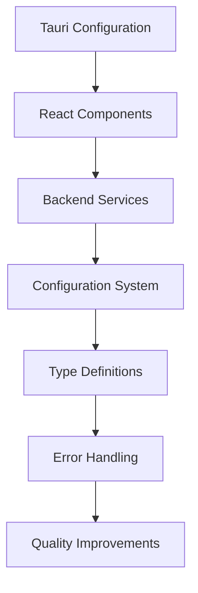

# Design Document

## Overview

This design addresses the critical fixes and missing components needed to establish a stable, functional foundation for the Vintage Story AI Assistant. The approach prioritizes immediate compilation and runtime issues, followed by service stability improvements, and concludes with code quality enhancements.

## Architecture

### Fix Implementation Strategy

The fixes are organized into three implementation layers:

1. **Foundation Layer**: Critical compilation and configuration fixes
2. **Service Layer**: Backend stability and reliability improvements  
3. **Quality Layer**: Type safety, error handling, and maintainability

### Component Dependencies



## Components and Interfaces

### 1. Configuration Fixes

#### Tauri Configuration (`src-tauri/tauri.conf.json`)
- **Purpose**: Enable required plugins and permissions
- **Key Changes**:
  - Add fs plugin with full scope access
  - Configure http plugin for Ollama API access
  - Enable shell plugin for Ollama management
  - Set proper CSP headers for security

#### Package Configuration (`package.json`)
- **Purpose**: Fix incomplete npm scripts
- **Key Changes**:
  - Complete tauri script definition
  - Ensure proper development workflow

### 2. React Component Implementation

#### MessageRenderer Component
```typescript
interface MessageRendererProps {
  content: string;
  isUser: boolean;
}
```
- **Purpose**: Render chat messages with markdown support
- **Features**:
  - Markdown parsing with syntax highlighting
  - User vs AI message differentiation
  - Code block rendering with Prism

#### Settings Component
```typescript
interface SettingsProps {
  isOpen: boolean;
  onClose: () => void;
  selectedModel: string;
  onModelChange: (model: string) => void;
  availableModels: ModelInfo[];
  temperature: number;
  onTemperatureChange: (temp: number) => void;
  maxContextChunks: number;
  onMaxContextChunksChange: (chunks: number) => void;
  theme: 'light' | 'dark';
  onThemeChange: (theme: 'light' | 'dark') => void;
}
```
- **Purpose**: Provide user configuration interface
- **Features**:
  - Model selection dropdown
  - Temperature slider control
  - Context chunk configuration
  - Theme selection

#### ChatHistory Component
```typescript
interface ChatHistoryProps {
  isOpen: boolean;
  onClose: () => void;
  sessions: ChatSession[];
  currentSessionId: string | null;
  onSelectSession: (id: string) => void;
  onDeleteSession: (id: string) => void;
  onNewSession: () => void;
  onExportSession: (id: string) => void;
  onImportSession: (file: File) => void;
}
```
- **Purpose**: Manage chat session history
- **Features**:
  - Session list with metadata
  - Export/import functionality
  - Session management operations

### 3. Backend Service Improvements

#### OllamaManager Enhancements
- **Process Cleanup**: Implement Drop trait for proper resource management
- **Streaming Response Handling**: Add robust error handling for malformed JSON
- **Download Integrity**: Verify installer downloads before execution
- **Race Condition Prevention**: Add proper synchronization mechanisms

#### Configuration System Implementation
```rust
impl AppConfig {
    pub fn load() -> AppResult<Self>
    pub fn save(&self) -> AppResult<()>
    fn get_config_path() -> PathBuf
}
```
- **Purpose**: Persistent configuration management
- **Features**:
  - Automatic config file creation
  - Error recovery with defaults
  - Cross-platform config location

## Data Models

### TypeScript Interfaces

#### Core Chat Types
```typescript
interface ChatMessage {
  id: string;
  content: string;
  role: 'user' | 'assistant' | 'error';
  timestamp: string;
}

interface ChatSession {
  id: string;
  title: string;
  timestamp: string;
  messages: ChatMessage[];
}

interface ChatResponse {
  message: ChatMessage;
  context_used: string[];
}
```

#### System Status Types
```typescript
interface OllamaStatus {
  is_running: boolean;
  is_installed: boolean;
  version?: string;
  models: ModelInfo[];
}

interface ModelInfo {
  name: string;
  size: number;
  digest: string;
  details: {
    parameter_size: string;
    quantization_level: string;
    family: string;
  };
}

interface SystemStatus {
  ollama_ready: boolean;
  wiki_ready: boolean;
  error_message?: string;
}
```

### Rust Data Structures

#### Configuration Model
```rust
#[derive(Debug, Clone, Serialize, Deserialize)]
pub struct AppConfig {
    pub ollama_url: String,
    pub selected_model: String,
    pub temperature: f32,
    pub max_context_chunks: usize,
    pub theme: String,
    pub auto_update_wiki: bool,
}
```

## Error Handling

### Error Boundary Implementation
- **Purpose**: Prevent component crashes from affecting entire application
- **Features**:
  - Graceful error display
  - Application reload option
  - Error logging for debugging

### Input Validation
```rust
pub fn validate_model_name(name: &str) -> AppResult<()>
pub fn validate_message_content(content: &str) -> AppResult<()>
```
- **Purpose**: Prevent invalid data from causing runtime errors
- **Validation Rules**:
  - Model name format and length checks
  - Message content length limits
  - Character set validation

### Service Error Handling
- **Streaming Response Errors**: Continue processing on malformed JSON
- **Download Failures**: Retry mechanisms and integrity checks
- **Configuration Errors**: Fallback to defaults with user notification

## Testing Strategy

### Component Testing
- **Unit Tests**: Individual component functionality
- **Integration Tests**: Component interaction with backend
- **Error Scenario Tests**: Graceful error handling verification

### Service Testing
- **Process Management**: Verify proper cleanup and resource management
- **Configuration Persistence**: Test save/load cycles
- **Error Recovery**: Test fallback mechanisms

### End-to-End Testing
- **Compilation Verification**: Ensure all fixes allow successful builds
- **Runtime Stability**: Verify application runs without crashes
- **User Workflow**: Test complete user interactions

## Implementation Approach

### Phase 1: Critical Fixes (Immediate)
1. Update Tauri configuration
2. Fix package.json scripts
3. Create missing React components
4. Verify compilation and basic functionality

### Phase 2: Service Stability (High Priority)
1. Implement OllamaManager improvements
2. Add configuration system
3. Fix React useEffect dependencies
4. Add TypeScript interfaces

### Phase 3: Quality Improvements (Medium Priority)
1. Add error boundaries
2. Implement input validation
3. Technology decision resolution
4. Code quality enhancements

### Integration Points
- **Frontend-Backend Communication**: Ensure all Tauri invoke calls have proper handlers
- **Type Consistency**: Maintain type safety across the TypeScript-Rust boundary
- **Error Propagation**: Consistent error handling from backend to frontend display

### Risk Mitigation
- **Incremental Implementation**: Test each fix independently
- **Backward Compatibility**: Ensure fixes don't break existing functionality
- **Rollback Strategy**: Maintain ability to revert problematic changes