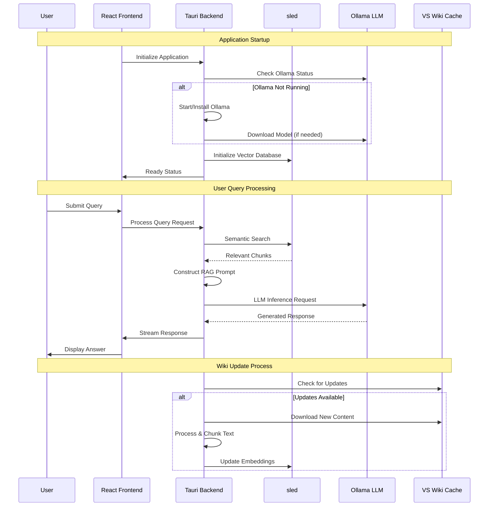

# Local Vintage Story AI Assistant - Technical Blueprint

## 1. Project Overview

The **Local Vintage Story AI Assistant** is a standalone, offline-first desktop application designed to provide intelligent, context-aware assistance for players of the sandbox survival game *Vintage Story*. The application leverages local Large Language Models (LLMs) and Retrieval-Augmented Generation (RAG) to deliver accurate, up-to-date information without requiring internet connectivity during normal operation.

### Core Value Proposition
- **Complete Privacy**: All AI processing happens locally with no data transmission to external servers
- **Offline-First**: Fully functional without internet connectivity once initially configured
- **Game-Specific Intelligence**: Specialized knowledge base built from the official Vintage Story Wiki
- **Cross-Platform**: Native support for Windows, macOS, and Linux
- **Zero-Config**: One-click installer with automated LLM setup and model provisioning

### Target Audience
- Vintage Story players seeking quick, reliable game information
- Modders and content creators requiring detailed technical references
- Server administrators needing configuration guidance

## 2. Technology Stack

| Component | Technology | Justification |
|-----------|------------|---------------|
| **Desktop Framework** | Tauri (Rust + WebView) | • Small binary size (10-50MB vs 100MB+ for Electron)<br>• Superior memory efficiency<br>• Built-in security features (CSP, sandboxing)<br>• Excellent cross-platform bundling<br>• Native OS integration capabilities |
| **Frontend UI** | React 18 + TypeScript | • Mature ecosystem with extensive component libraries<br>• Excellent developer experience<br>• Strong TypeScript integration for type safety<br>• Compatible with Tauri's WebView architecture |
| **Backend Runtime** | Rust (via Tauri) | • Memory safety and performance<br>• Excellent concurrency handling<br>• Native integration with system APIs<br>• Strong ecosystem for HTTP clients and JSON processing |
| **Local LLM Engine** | Ollama | • Cross-platform LLM runtime<br>• Simple REST API interface<br>• Efficient model management and caching<br>• Support for quantized models (reduced resource usage)<br>• Active community and regular updates |
| **Recommended Models** | • `phi-3:mini` (3.8B params)<br>• `llama3.2:3b`<br>• `qwen2.5:3b` | • Optimized for resource-constrained environments<br>• Good performance on knowledge tasks<br>• Fast inference times<br>• Manageable download sizes (2-4GB) |
| **Vector Database** | sled | • Embedded key-value store, no external dependencies<br>• Pure Rust implementation<br>• Sufficient for current RAG needs<br>• Low resource usage<br>• Abstracted interface for future upgrades |
| **Embedding Model** | `sentence-transformers/all-MiniLM-L6-v2` | • Lightweight (80MB) with good performance<br>• Optimized for semantic similarity tasks<br>• Well-established in RAG applications<br>• Fast inference on CPU |
| **Web Scraping** | `scraper` + `reqwest` (Rust) | • Native Rust HTML parsing<br>• Robust error handling<br>• Async/await support for concurrent scraping<br>• Built-in rate limiting capabilities |
| **Packaging** | Tauri Bundler | • Native installer generation (MSI, DMG, AppImage)<br>• Code signing integration<br>• Auto-updater support<br>• Minimal external dependencies |

## 3. System Architecture



### Component Interactions

**Frontend Layer (React)**
- Handles user interface rendering and state management
- Manages real-time status indicators for backend services
- Implements responsive chat interface with typing indicators
- Provides settings and configuration panels

**Backend Layer (Tauri/Rust)**
- **OllamaManager**: Lifecycle management, health monitoring, model downloads
- **WikiService**: Automated content acquisition, processing, and updates
- **EmbeddingService**: Text chunking, vector generation, and database operations
- **ChatService**: Orchestrates RAG pipeline and LLM interactions

**Data Layer**
- **Vector Database**: Stores embeddings and metadata for fast similarity search
- **Content Cache**: Processed wiki content with version tracking
- **User Data**: Chat history, preferences, and application state

## 4. Implementation Plan

### Phase 1: Core Backend & Infrastructure (4-6 weeks)

#### Week 1-2: Project Foundation
**Deliverables:**
- Set up Tauri project with Rust backend and React frontend
- Implement basic project structure and configuration management
- Create OllamaManager with installation detection and basic lifecycle management
- Design and implement local database schema for content and embeddings

**Key Tasks:**
- Configure Tauri with appropriate permissions and security settings
- Implement cross-platform file system operations for model storage
- Create configuration system for user preferences and application state
- Set up logging and error handling infrastructure

#### Week 3-4: LLM Integration
**Deliverables:**
- Complete Ollama integration with automatic installation and model management
- Implement model download progress tracking and user feedback
- Create LLM inference service with request queuing and timeout handling
- Build health monitoring and automatic recovery mechanisms

**Key Tasks:**
- Handle cross-platform Ollama binary download and installation
- Implement model selection interface with resource requirement indicators
- Create robust error handling for LLM failures and recovery strategies
- Add request rate limiting and resource monitoring

#### Week 5-6: RAG Pipeline Foundation
**Deliverables:**
- Implement Vintage Story Wiki scraper with respect for robots.txt
- Create text processing pipeline with semantic chunking
- Set up LanceDB integration with embedding storage and retrieval
- Build content update mechanism with version tracking

**Key Tasks:**
- Design optimal chunking strategy for wiki content (sections, subsections, etc.)
- Implement embedding generation with batch processing for efficiency
- Create similarity search with relevance scoring and filtering
- Add incremental update capability for modified wiki content

### Phase 2: Application Frontend (3-4 weeks)

#### Week 7-8: Core UI Development
**Deliverables:**
- Implement responsive chat interface with message history
- Create status dashboard showing system health and resource usage
- Build onboarding flow for first-time users
- Add settings panel for configuration management

**Key Tasks:**
- Design and implement clean, intuitive chat interface
- Create real-time status indicators for backend services
- Implement message threading and conversation management
- Add keyboard shortcuts and accessibility features

#### Week 9-10: Advanced Features
**Deliverables:**
- Implement search functionality within chat history
- Create export/import capabilities for user data
- Add theme support and UI customization options
- Build comprehensive error handling and user feedback system

**Key Tasks:**
- Implement full-text search across chat history
- Create data backup and restore functionality
- Add progress indicators for long-running operations
- Implement contextual help and documentation system

### Phase 3: Integration & Polish (2-3 weeks)

#### Week 11: Integration Testing
**Deliverables:**
- Complete end-to-end integration testing across all platforms
- Performance optimization and resource usage improvements
- Comprehensive error handling and edge case management
- Security audit and penetration testing

**Key Tasks:**
- Test complete user workflows from installation to advanced usage
- Optimize memory usage and response times
- Implement comprehensive logging for debugging and support
- Validate security measures and data protection

#### Week 12-13: Distribution & Documentation
**Deliverables:**
- Create platform-specific installers (MSI, DMG, AppImage)
- Implement auto-updater functionality
- Complete user documentation and troubleshooting guides
- Set up build automation and release pipeline

**Key Tasks:**
- Configure code signing for Windows and macOS distributions
- Test installers across multiple OS versions and configurations
- Create comprehensive user guides and developer documentation
- Implement telemetry (optional, privacy-focused) for usage insights

## 5. Key Challenges & Solutions

### Challenge 1: Ollama Lifecycle Management

**Problem:** Ensuring Ollama is consistently available and properly configured across different operating systems and user environments.

**Technical Details:**
- Ollama installation varies significantly across platforms
- Users may have existing Ollama installations with different configurations
- Model downloads can be large (2-8GB) and may fail or be interrupted
- Service management requires elevated privileges on some systems

**Solution:**
```rust
pub struct OllamaManager {
    installation_path: PathBuf,
    config: OllamaConfig,
    process_handle: Option<Child>,
}

impl OllamaManager {
    pub async fn ensure_available(&mut self) -> Result<(), OllamaError> {
        // 1. Check for existing installation
        if self.detect_existing_installation().await.is_ok() {
            return self.verify_health().await;
        }
        
        // 2. Download and install if needed
        self.download_and_install().await?;
        
        // 3. Start service and verify
        self.start_service().await?;
        self.verify_health().await
    }
    
    async fn download_and_install(&self) -> Result<(), OllamaError> {
        // Platform-specific installation logic
        match std::env::consts::OS {
            "windows" => self.install_windows().await,
            "macos" => self.install_macos().await,
            "linux" => self.install_linux().await,
            _ => Err(OllamaError::UnsupportedPlatform),
        }
    }
}
```

**Implementation Strategy:**
- Implement robust detection of existing Ollama installations
- Use platform-specific installation methods (MSI for Windows, pkg for macOS, etc.)
- Create health check system with automatic restart capabilities
- Implement graceful degradation when Ollama is unavailable

### Challenge 2: RAG Performance & Quality

**Problem:** Balancing retrieval accuracy with response speed while maintaining high-quality, contextually relevant answers.

**Technical Details:**
- Wiki content varies in structure and information density
- Semantic search may miss exact keyword matches
- Context window limitations require careful chunk selection
- User queries range from simple facts to complex multi-step processes

**Solution:**
```rust
pub struct HybridRetriever {
    vector_store: LanceDB,
    keyword_index: TantivyIndex,
    chunk_scorer: ChunkScorer,
}

impl HybridRetriever {
    pub async fn retrieve(&self, query: &str, limit: usize) -> Result<Vec<RelevantChunk>, RAGError> {
        // 1. Parallel semantic and keyword search
        let (semantic_results, keyword_results) = tokio::join!(
            self.semantic_search(query, limit * 2),
            self.keyword_search(query, limit * 2)
        );
        
        // 2. Score and merge results
        let mut combined_results = self.merge_and_score(
            semantic_results?, 
            keyword_results?
        );
        
        // 3. Apply relevance filtering and re-ranking
        combined_results.sort_by(|a, b| b.score.partial_cmp(&a.score).unwrap());
        
        // 4. Ensure diversity and avoid redundancy
        let filtered_results = self.diversify_results(combined_results, limit);
        
        Ok(filtered_results)
    }
}
```

**Implementation Strategy:**
- Implement hybrid search combining semantic and keyword matching
- Use intelligent chunking that respects document structure (sections, subsections)
- Create relevance scoring system with multiple factors (semantic similarity, keyword match, recency)
- Implement result diversification to avoid redundant information

### Challenge 3: Cross-Platform Distribution & Updates

**Problem:** Creating reliable, secure installers for three different platforms while maintaining a smooth update experience.

**Technical Details:**
- Code signing requirements for Windows and macOS
- Different package formats and installation mechanisms
- Auto-updater implementation across platforms
- Handling permissions and security restrictions
- Managing large binary sizes efficiently

**Solution:**
```rust
// tauri.conf.json configuration
{
  "bundle": {
    "active": true,
    "targets": ["msi", "dmg", "appimage"],
    "identifier": "com.vintagestory.ai-assistant",
    "windows": {
      "certificateThumbprint": "${WINDOWS_CERTIFICATE_THUMBPRINT}",
      "digestAlgorithm": "sha256",
      "timestampUrl": "http://timestamp.digicert.com"
    },
    "macOS": {
      "frameworks": [],
      "minimumSystemVersion": "10.15",
      "hardenedRuntime": true,
      "entitlements": "entitlements.plist"
    }
  },
  "updater": {
    "active": true,
    "endpoints": ["https://releases.myapp.com/{{target}}/{{current_version}}"],
    "dialog": true,
    "pubkey": "${TAURI_PUBLIC_KEY}"
  }
}
```

**Implementation Strategy:**
- Use Tauri's built-in bundling system with platform-specific configurations
- Implement delta updates to minimize download sizes
- Create comprehensive testing matrix across OS versions and architectures
- Set up automated build pipeline with proper code signing
- Implement rollback mechanism for failed updates

## 6. Technical Specifications

### Minimum System Requirements
- **RAM:** 8GB (4GB available for application)
- **Storage:** 10GB free space (models + data + application)
- **CPU:** Modern multi-core processor (Intel i5 equivalent or better)
- **OS:** Windows 10+, macOS 10.15+, Ubuntu 18.04+ (or equivalent Linux)

### Performance Targets
- **Application Startup:** < 3 seconds to ready state
- **Query Response Time:** < 5 seconds for typical queries
- **Memory Usage:** < 2GB during normal operation
- **Binary Size:** < 50MB (excluding models and data)

### Security Considerations
- All user data stored locally with encryption at rest
- No telemetry or analytics without explicit user consent
- Sandboxed execution environment via Tauri security model
- Regular security updates through automated update system

This blueprint provides a comprehensive foundation for building a robust, user-friendly Local Vintage Story AI Assistant that prioritizes privacy, performance, and user experience.